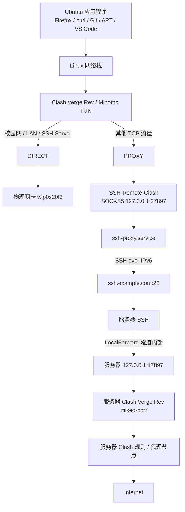
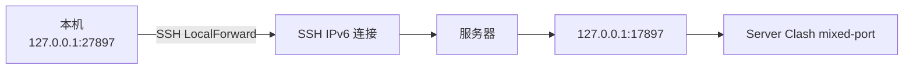
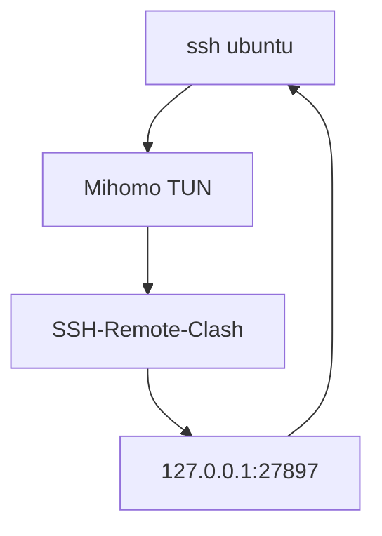
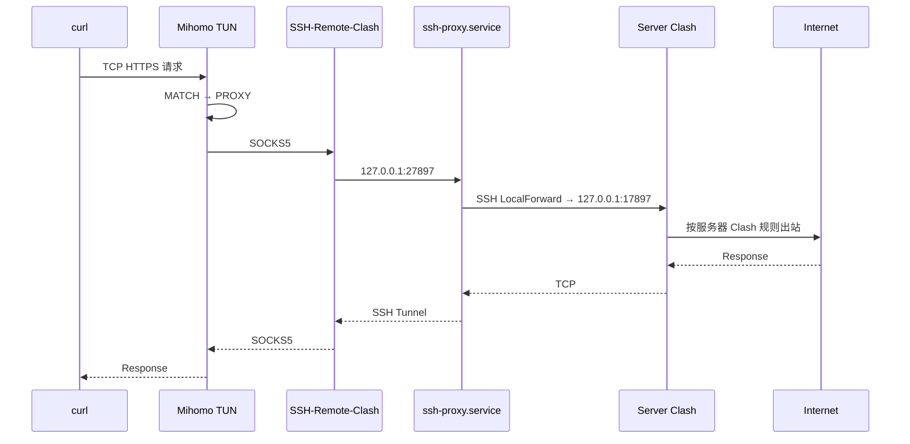
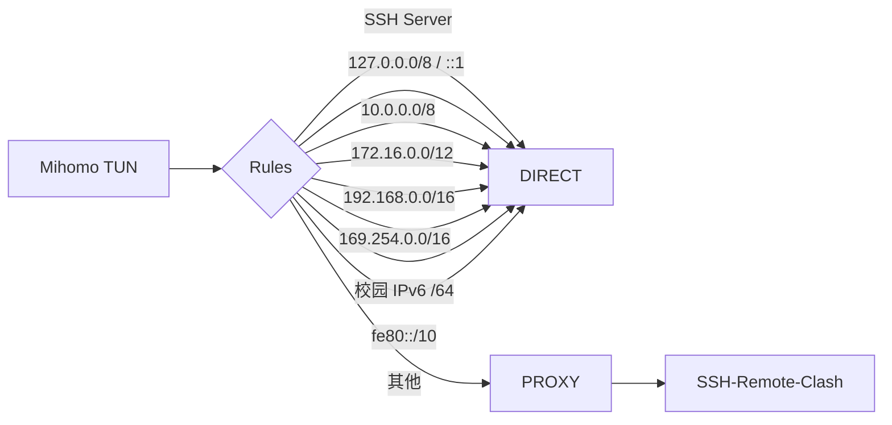
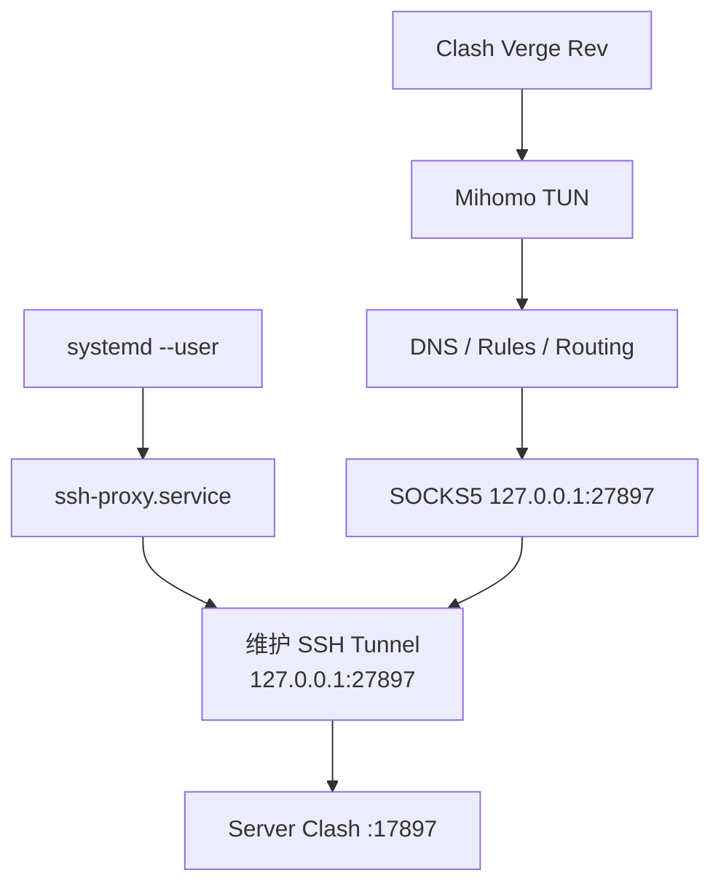

# 前言

> 本文是在  基础上的进阶方案，重点介绍如何使用 Clash Verge Rev 的 TUN 模式透明接管系统流量。

本方案用于在 Ubuntu 本机通过 **Clash Verge Rev 的
TUN（虚拟网卡）模式**透明接管系统网络流量，再将需要代理的 TCP
流量送入本机 SSH LocalForward，最终交给服务器上的 Clash Verge Rev 处理。

最终不再依赖：

``` bash
export http_proxy=...
export https_proxy=...
```

应用程序无需单独配置 HTTP/SOCKS 代理。

> 注：本文使用 Mermaid 流程图。支持 Mermaid 的 Markdown 阅读器（如
> GitHub、部分编辑器/笔记软件）可直接渲染。

# 1. 整体架构



## 1.1 各端口职责

| 位置 | 地址 | 作用 |
| --- | --- | --- |
| 本机 Clash | `127.0.0.1:7890` | 本机 mixed-port |
| 本机 Clash | `127.0.0.1:9090` | 本机 External Controller |
| 本机 SSH | `127.0.0.1:27897` | SSH LocalForward 的本地入口 |
| 服务器 Clash | `127.0.0.1:17897` | 服务器 mixed-port，接受 HTTP/SOCKS |
| 服务器 Clash | `127.0.0.1:9097` | 服务器 External Controller，仅用于管理 |

服务器 `9097` 和 API Secret **不参与代理数据链路**。

# 2. 配置方法

## 2.1 SSH 隧道

systemd 用户服务：

`~/.config/systemd/user/ssh-proxy.service`

``` ini
[Unit]
Description=SSH tunnel to remote proxy
After=network-online.target
Wants=network-online.target

[Service]
Type=simple
ExecStart=/usr/bin/ssh \
    -N \
    -L 127.0.0.1:27897:127.0.0.1:17897 \
    -o ExitOnForwardFailure=yes \
    -o ServerAliveInterval=30 \
    -o ServerAliveCountMax=3 \
    -o TCPKeepAlive=yes \
    ubuntu

Restart=always
RestartSec=5

[Install]
WantedBy=default.target
```

启用：

``` bash
systemctl --user daemon-reload
systemctl --user enable --now ssh-proxy
```

查看：

``` bash
systemctl --user status ssh-proxy --no-pager
ss -lntp | grep 27897
```

数据路径：



SSH `-L` 是 TCP 转发，因此本机 Clash 上游设置为 `udp: false`。

## 2.2 本机 Clash Verge Rev 配置

运行以下命令查看本机各网络接口的地址：

```bash
ip -br addr
```

根据输出确认需要保持本地直连的局域网网段，并将这些网段添加到
`DIRECT` 规则，从而避免校园网、家庭局域网、Docker 或虚拟机网段被送入
远程代理。


当前校园 IPv4 地址为 `10.102.214.241/16`，因此 `10.0.0.0/8`
已覆盖该网络。

公网 IPv6 前缀以下文的 `2001:db8:1234:5678::/64` 为例。它属于 RFC 3849
保留的文档地址，仅用于展示配置格式，使用时必须替换为 `ip -br addr`
显示的实际前缀。实际前缀可能随 AP、VLAN 或网络分配发生变化，因此不应
假定某个 `/64` 代表整个校园 IPv6 地址空间。

下面给出示例配置文件 `home.yaml`。其中 `ssh.example.com` 是保留的示例域名，
`2001:db8:1234:5678::/64` 是保留的文档地址。导入前必须分别替换为自己的
SSH 服务器域名和本地公网 IPv6 前缀。

``` yaml
mixed-port: 7890
allow-lan: false
bind-address: 127.0.0.1

mode: rule
log-level: info
ipv6: true

external-controller: 127.0.0.1:9090
secret: ""

profile:
  store-selected: true
  store-fake-ip: true

tun:
  enable: true
  stack: mixed
  auto-route: true
  auto-redirect: true
  auto-detect-interface: true
  strict-route: true
  dns-hijack:
    - any:53
    - tcp://any:53

dns:
  enable: true
  listen: 127.0.0.1:1053
  ipv6: true
  enhanced-mode: fake-ip
  fake-ip-range: 198.18.0.1/16

  default-nameserver:
    - system
    - 223.5.5.5

  proxy-server-nameserver:
    - system

  nameserver:
    - system
    - 223.5.5.5
    - 119.29.29.29

  fallback:
    - 1.1.1.1
    - 8.8.8.8

proxies:
  - name: SSH-Remote-Clash
    type: socks5
    server: 127.0.0.1
    port: 27897
    udp: false

proxy-groups:
  - name: PROXY
    type: select
    proxies:
      - SSH-Remote-Clash
      - DIRECT

rules:
  # SSH 服务器必须直连，防止 SSH 隧道进入自身
  - DOMAIN,ssh.example.com,DIRECT

  # Loopback
  - IP-CIDR,127.0.0.0/8,DIRECT,no-resolve
  - IP-CIDR6,::1/128,DIRECT,no-resolve

  # 私有 IPv4 / 校园网 / Docker / libvirt
  - IP-CIDR,10.0.0.0/8,DIRECT,no-resolve
  - IP-CIDR,172.16.0.0/12,DIRECT,no-resolve
  - IP-CIDR,192.168.0.0/16,DIRECT,no-resolve
  - IP-CIDR,169.254.0.0/16,DIRECT,no-resolve

  # 校园 WLAN IPv6 子网（示例，必须替换）
  - IP-CIDR6,2001:db8:1234:5678::/64,DIRECT,no-resolve

  # IPv6 link-local
  - IP-CIDR6,fe80::/10,DIRECT,no-resolve

  # 其余流量进入 SSH → Server Clash
  - MATCH,PROXY
```

这里的 External Controller 仅绑定到 `127.0.0.1`，因此示例中将 `secret`
留空。如果把 `external-controller` 改为 `0.0.0.0`、局域网地址或其他
非回环地址，必须设置强随机密钥，并通过防火墙限制访问范围。


# 3. 工作原理

## 3.1 为什么 SSH 服务器必须 DIRECT

当前通过 AAAA 记录使用 IPv6 建立 SSH 连接。

本文使用 `ssh.example.com` 作为 SSH 服务器域名示例，实际配置时必须替换
为 `~/.ssh/config` 中 `HostName` 对应的真实域名。

如果 SSH 服务器本身也匹配：

``` yaml
- MATCH,PROXY
```

理论上可能产生递归：



因此必须提前：

``` yaml
- DOMAIN,ssh.example.com,DIRECT
```

使 SSH 连接直接通过物理网络到达服务器。

对于 DDNS 主机，不建议长期只硬编码当前 `/128` IPv6 地址，因为服务器公网
IPv6 变化后规则会失效。

## 3.2 TUN 如何接管系统流量

Clash Verge Rev 创建了：

``` text
Mihomo
IPv4: 198.18.0.1/30
IPv6: fdfe:dcba:9876::1/126
```

本机已经观察到类似：

``` text
7: Mihomo: <POINTOPOINT,MULTICAST,NOARP,UP,LOWER_UP>
    inet 198.18.0.1/30
    inet6 fdfe:dcba:9876::1/126
```

`auto-route`、`auto-redirect` 等机制负责将系统流量送入 Mihomo。Linux
主路由表仍可能显示：

``` text
default via 10.102.0.1 dev wlp0s20f3
```

这并不表示 TUN 没有工作，因为 Mihomo 还可结合 policy routing / nftables
等机制进行透明接管。

## 3.3 一次普通 HTTPS 请求的完整路径

例如：

``` bash
curl https://ipinfo.io/ip
```

在没有 `HTTP_PROXY` / `HTTPS_PROXY` 的情况下：



请求返回的应是服务器端 Clash 最终选择的出口公网 IP。如果服务器端选择了
代理节点，这里显示的是该节点的出口 IP；只有服务器端使用 `DIRECT` 出站时，
结果才通常是 SSH 服务器自身的公网 IP。

并且 Clash Verge Rev "连接"页面已经观察到：

``` text
daisy.ubuntu.com:443 → PROXY / SSH-Remote-Clash
```

说明流量确实经过 Mihomo TUN 和 `SSH-Remote-Clash`。

## 3.4 DIRECT 流量

以下流量不应该进入服务器代理：



这样同时保护：

-   SSH 连接不发生代理递归；
-   校园局域网直接访问；
-   Docker `172.17.0.0/16` 直接访问；
-   libvirt `192.168.122.0/24` 直接访问；
-   localhost 不进入代理链。

# 4. 验证与使用

## 4.1 验证方法

### 4.1.1 验证 SSH 隧道

``` bash
systemctl --user status ssh-proxy --no-pager
ss -lntp | grep 27897
```

### 4.1.2 单独验证 SSH → Server Clash

``` bash
curl --proxy socks5h://127.0.0.1:27897 https://ipinfo.io/ip
```

### 4.1.3 验证 TUN

清除环境代理：

``` bash
unset http_proxy https_proxy HTTP_PROXY HTTPS_PROXY
env | grep -i proxy
```

直接请求：

``` bash
curl https://ipinfo.io/ip
```

如果两种方式均得到相同代理出口，例如：

``` text
203.0.113.10
```

`203.0.113.10` 属于 RFC 5737 保留的文档地址，仅表示此处应出现一个公网
出口 IP，并不是真实测试结果。

同时 Clash "连接"页面显示：

``` text
PROXY / SSH-Remote-Clash
```

则完整链路已经成功。

查看 TUN：

``` bash
ip -br addr
ip rule
ip -6 rule
```

必要时检查 nftables：

``` bash
sudo nft list ruleset | grep -i -C 3 mihomo
```

## 4.2 不再需要 proxy-on 环境变量

旧方案：

``` bash
proxy-on() {
    systemctl --user start ssh-proxy
    export http_proxy=http://127.0.0.1:27897
    export https_proxy=http://127.0.0.1:27897
    export HTTP_PROXY=$http_proxy
    export HTTPS_PROXY=$https_proxy
}
```

新方案中：

-   `ssh-proxy.service` 登录后常驻；
-   Clash TUN 开启时透明接管流量；
-   TUN 关闭时系统恢复正常直连；
-   应用程序无需支持代理环境变量。

因此 `proxy-on` 不再是必要组件。

## 4.3 UDP 限制

当前路径使用：

``` text
ssh -L
```

它是 TCP LocalForward。

因此本机节点必须保持：

``` yaml
udp: false
```

当前方案主要代理 TCP 流量。QUIC、游戏和其他纯 UDP 流量不能依靠这条 SSH
`-L` 链路透明转发到服务器 Clash。

# 5. 总结



**systemd 负责隧道生命周期，Mihomo 负责网络接管和路由决策，服务器 Clash
负责最终代理出站。**

这种职责分离比通过 shell 环境变量控制代理更完整，也更容易诊断故障。
